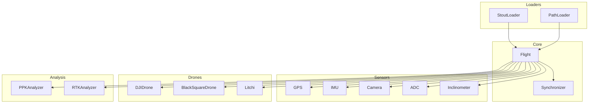

# API Reference

Complete API documentation for all PILS classes and methods.

## Modules Overview



## Quick Links

<div class="grid cards" markdown>

-   :material-cube:{ .lg .middle } __[Core](core/flight.md)__

    ---

    `Flight`, `Synchronizer` - Main containers and time alignment

-   :material-folder-open:{ .lg .middle } __[Loaders](loaders/index.md)__

    ---

    `PathLoader`, `StoutLoader` - Load flights from filesystem or database

-   :material-radar:{ .lg .middle } __[Sensors](sensors/index.md)__

    ---

    `GPS`, `IMU`, `Camera`, `ADC`, `Inclinometer` - Sensor data access

-   :material-quadcopter:{ .lg .middle } __[Drones](drones/index.md)__

    ---

    `DJIDrone`, `BlackSquareDrone`, `Litchi` - Platform support

-   :material-chart-line:{ .lg .middle } __[Analysis](analysis/index.md)__

    ---

    `PPKAnalyzer`, `RTKAnalyzer` - Positioning analysis

-   :material-tools:{ .lg .middle } __[Utilities](utilities/index.md)__

    ---

    Helper functions and decoders

</div>

## Import Patterns

```python
# Core
from pils.flight import Flight
from pils.synchronizer import Synchronizer

# Loaders
from pils.loader.path import PathLoader
from pils.loader.stout import StoutLoader

# Sensors (direct)
from pils.sensors import GPS, IMU, Camera, ADC, Inclinometer

# Drones (direct)
from pils.drones import DJIDrone, BlackSquareDrone, Litchi

# Analysis
from pils.analyze.ppk import PPKAnalyzer
from pils.analyze.rtkdata.RTKLIB import RTKAnalyzer

# Utilities
from pils.utils.tools import validate_path, ensure_directory
```

## Type Conventions

PILS uses modern Python type hints:

```python
# Union types (Python 3.10+)
path: str | Path

# Optional
sensors: Optional[List[str]] = None

# Return types
def load_data() -> pl.DataFrame

# Generic dicts
def get_metadata() -> Dict[str, Any]
```

## Common Return Types

| Type | Description |
|------|-------------|
| `pl.DataFrame` | Polars DataFrame with sensor/drone data |
| `Dict[str, pl.DataFrame]` | Multiple named DataFrames |
| `Dict[str, Any]` | Metadata or configuration |
| `Path` | Pathlib Path object |
| `List[Dict]` | List of flight info dictionaries |
