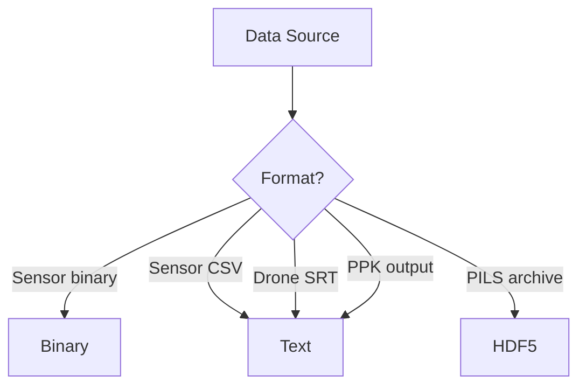

# File Formats

Reference documentation for all file formats supported by PILS.

## Overview

PILS handles multiple file formats from various sources:

| Format | Description | Use Case |
|--------|-------------|----------|
| [Binary](binary.md) | Binary sensor protocols | Inclinometer, u-blox |
| [Text](text.md) | CSV and ASCII formats | Most sensor data |
| [HDF5](hdf5.md) | Hierarchical data | PILS export/import |

## Format Selection



## Quick Reference

### Reading Data

```python
import polars as pl
from pils.flight import Flight

# CSV files
df = pl.read_csv("data.csv")

# HDF5 files
flight = Flight.from_hdf5("flight.h5")

# Binary files (via sensor classes)
from pils.sensors.inclinometer import Inclinometer
incl = Inclinometer(file="data.bin")
df = incl.data
```

### Writing Data

```python
# CSV export
df.write_csv("output.csv")

# HDF5 export
flight.to_hdf5("flight.h5")

# Parquet (efficient)
df.write_parquet("output.parquet")
```

---

## See Also

- [DataFrame Schemas](../schemas/index.md) - Column definitions
- [Directory Structure](../directory-structure.md) - Folder layouts
