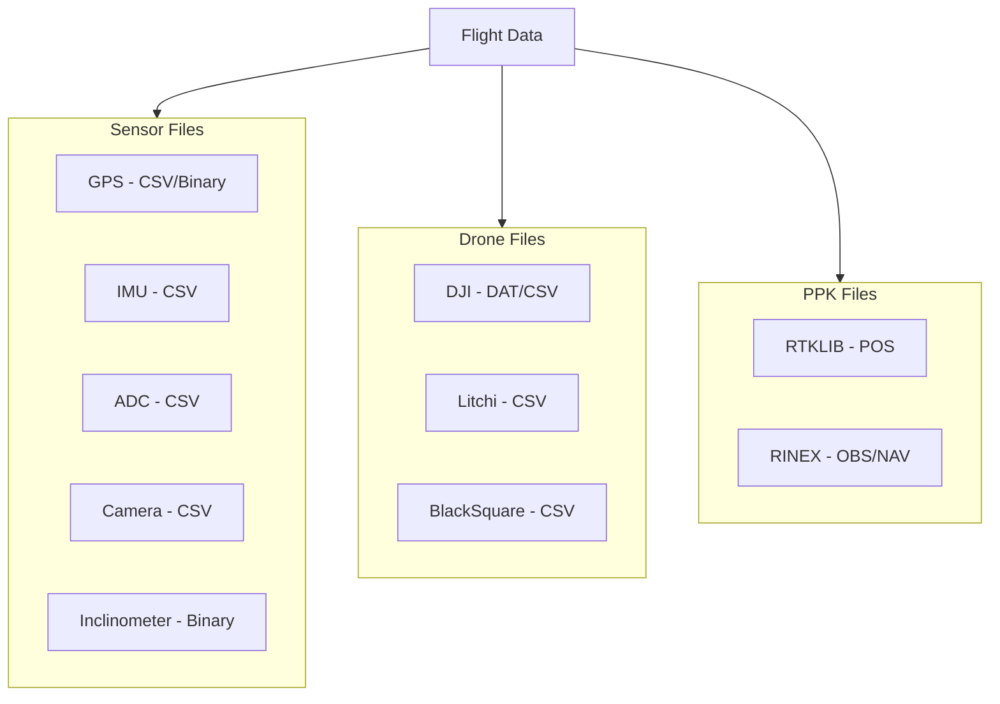

# Data Formats

Complete reference for all data formats, schemas, and file structures used in PILS.

## Overview

PILS handles multiple data formats from various sources and :



## Sections

<div class="grid cards" markdown>

-   :material-database-outline: **[Sensor Schemas](schemas/gps.md)**
    
    Column definitions for all sensor data types
    
    ---
    
    GPS • IMU • ADC • Camera • Inclinometer

-   :material-file-document: **[File Formats](files/binary.md)**
    
    Binary, text, and HDF5 format specifications
    
    ---
    
    Binary protocols • CSV structure • HDF5 layout

-   :material-folder-outline: **[Directory Structure](directory-structure.md)**
    
    Expected folder organization for flight data
    
    ---
    
    PathLoader • StoutLoader • Nested layouts

</div>

## Data Types

### Polars Schema Reference

| PILS Type | Polars Type | Description |
|-----------|-------------|-------------|
| Timestamp | `Int64` / `Float64` | Unix microseconds |
| Latitude | `Float64` | Decimal degrees |
| Longitude | `Float64` | Decimal degrees |
| Altitude | `Float64` | Meters |
| Acceleration | `Float64` | g or m/s² |
| Angular Rate | `Float64` | °/s or rad/s |
| Voltage | `Float64` | Volts |
| Temperature | `Float64` | Celsius |
| Quality Flag | `Int64` | Quality code |

### Coordinate Systems

| System | Description | Units |
|--------|-------------|-------|
| WGS84 | GPS coordinates | degrees, meters |
| ENU | East-North-Up | meters |
| NED | North-East-Down | meters |
| Body | Aircraft frame | meters |

---

## Quick Reference

### Common Timestamp Formats

```python
import polars as pl
from datetime import datetime

# Unix microseconds (sensor data)
timestamp_us: int = 1700000000000000

# Convert to datetime
dt = datetime.fromtimestamp(timestamp_us / 1_000_000)

# In Polars
df = df.with_columns(
    (pl.col('timestamp') / 1_000_000)
    .cast(pl.Datetime('us'))
    .alias('datetime')
)
```

### Common Conversions

```python
# Degrees to radians
import math
rad = deg * math.pi / 180

# Fahrenheit to Celsius
celsius = (fahrenheit - 32) * 5 / 9

# g to m/s²
acc_ms2 = acc_g * 9.80665
```

---

## See Also

- [Sensor Schemas](schemas/gps.md) - Detailed column definitions
- [File Formats](files/binary.md) - Format specifications
- [Directory Structure](directory-structure.md) - Folder layouts
