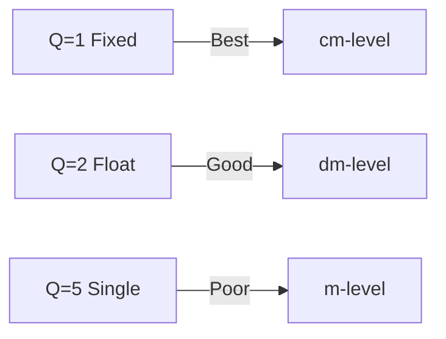

# PPK Schema

Post-Processed Kinematic position data schema reference.

## Position DataFrame Schema

RTKLIB `.pos` file output format.

| Column | Type | Unit | Description |
|--------|------|------|-------------|
| `datetime` | `Datetime` | UTC | Timestamp |
| `lat` | `Float64` | ° | Latitude (WGS84) |
| `lon` | `Float64` | ° | Longitude (WGS84) |
| `height` | `Float64` | m | Ellipsoidal height |
| `Q` | `Int64` | - | Solution quality |
| `ns` | `Int64` | - | Number of satellites |
| `sdn` | `Float64` | m | North std deviation |
| `sde` | `Float64` | m | East std deviation |
| `sdu` | `Float64` | m | Up std deviation |
| `sdne` | `Float64` | m | N-E covariance |
| `sdeu` | `Float64` | m | E-U covariance |
| `sdun` | `Float64` | m | U-N covariance |
| `age` | `Float64` | s | Age of differential |
| `ratio` | `Float64` | - | Ambiguity ratio |

---

## Quality Flags (Q)

| Value | Name | Typical Accuracy | Description |
|-------|------|------------------|-------------|
| 1 | Fixed | 1-2 cm | Integer ambiguity resolved |
| 2 | Float | 10-50 cm | Float ambiguity |
| 3 | SBAS | 1-5 m | SBAS-corrected |
| 4 | DGPS | 0.5-2 m | Differential GPS |
| 5 | Single | 2-10 m | Single-point positioning |

### Quality Interpretation



---

## Ambiguity Ratio

The ratio field indicates confidence in the integer ambiguity resolution:

| Ratio | Interpretation |
|-------|----------------|
| > 3.0 | High confidence |
| 2.0-3.0 | Medium confidence |
| < 2.0 | Low confidence |

!!! tip "Ratio Threshold"
    RTKLIB default threshold is 3.0. Higher ratios indicate more reliable fixed solutions.

---

## Position Statistics

### Computed by PPKAnalyzer

| Statistic | Description |
|-----------|-------------|
| `total_epochs` | Total position epochs |
| `fix_count` | Epochs with Q=1 |
| `float_count` | Epochs with Q=2 |
| `single_count` | Epochs with Q=5 |
| `fix_rate` | fix_count / total_epochs |
| `mean_sdn` | Mean north std dev |
| `mean_sde` | Mean east std dev |
| `mean_sdu` | Mean up std dev |
| `rms_horizontal` | √(sdn² + sde²) |
| `rms_3d` | √(sdn² + sde² + sdu²) |

---

## File Format

### RTKLIB POS Format

```
% GPST                  latitude(deg)  longitude(deg)  height(m)   Q  ns  sdn(m)  sde(m)  sdu(m) sdne(m) sdeu(m) sdun(m) age(s) ratio
2023/11/01 12:00:00.000  40.71280000  -74.00600000    10.500      1  12  0.010   0.008   0.020  0.000   0.000   0.000   1.0    5.2
2023/11/01 12:00:01.000  40.71280100  -74.00600100    10.510      1  12  0.010   0.008   0.020  0.000   0.000   0.000   1.0    5.3
```

### Column Positions

| Start | End | Field |
|-------|-----|-------|
| 0 | 23 | GPST datetime |
| 24 | 38 | latitude |
| 39 | 53 | longitude |
| 54 | 64 | height |
| 65 | 67 | Q |
| 68 | 71 | ns |
| 72+ | - | std devs, age, ratio |

---

## PPK Version Schema

Multiple processing runs stored by PPKAnalyzer.

| Attribute | Type | Description |
|-----------|------|-------------|
| `version_id` | `str` | Unique version identifier |
| `created_at` | `datetime` | Processing timestamp |
| `config` | `Dict` | RTKLIB configuration |
| `statistics` | `Dict` | Processing statistics |
| `positions` | `pl.DataFrame` | Position data |

### Version Config

| Key | Type | Description |
|-----|------|-------------|
| `mode` | `str` | Processing mode (static/kinematic) |
| `frequency` | `str` | L1/L1L2/L1L2L5 |
| `elevation_mask` | `float` | Elevation mask (degrees) |
| `snr_mask` | `float` | SNR mask (dB-Hz) |
| `ionosphere` | `str` | Iono model (broadcast/sbas/iono-free) |
| `troposphere` | `str` | Tropo model (saastamoinen/etc) |

---

## Example

```python
import polars as pl
from pils.analyze.ppk import PPKAnalyzer
from pathlib import Path

# Load PPK results
ppk = PPKAnalyzer(flight_path=Path("/data/flight"))

# Process with default config
version = ppk.process()

# Get position data
pos = version.positions

# Check schema
print(pos.schema)

# Quality analysis
quality_summary = pos.groupby('Q').agg([
    pl.count().alias('count'),
    pl.col('sdn').mean().alias('mean_sdn'),
    pl.col('sde').mean().alias('mean_sde'),
    pl.col('sdu').mean().alias('mean_sdu'),
])
print(quality_summary)

# Filter fixed solutions
fixed = pos.filter(pl.col('Q') == 1)
print(f"Fix rate: {fixed.height / pos.height:.1%}")

# Horizontal accuracy
pos = pos.with_columns([
    (pl.col('sdn')**2 + pl.col('sde')**2).sqrt().alias('sd_horizontal')
])

# 95th percentile accuracy
p95 = pos.select(pl.col('sd_horizontal').quantile(0.95))
print(f"95th percentile H accuracy: {p95[0,0]:.3f} m")
```

---

## See Also

- [PPK Analyzer API](../api/analysis/ppk.md)
- [RTK Analyzer API](../api/analysis/rtk.md)
- [GPS Schema](gps.md)
- [User Guide: PPK](../user-guide/ppk-analysis.md)
