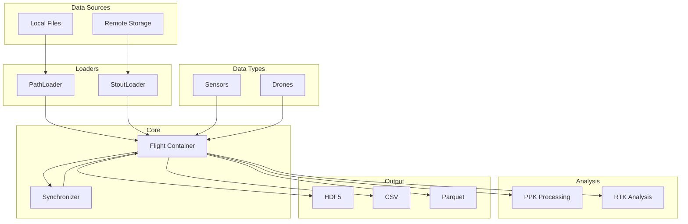
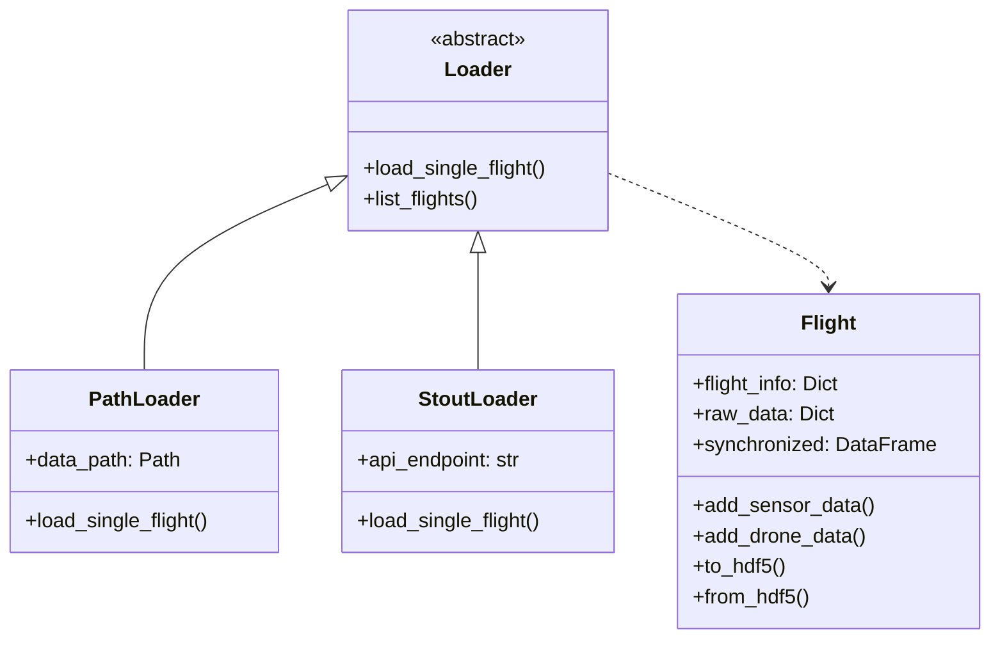
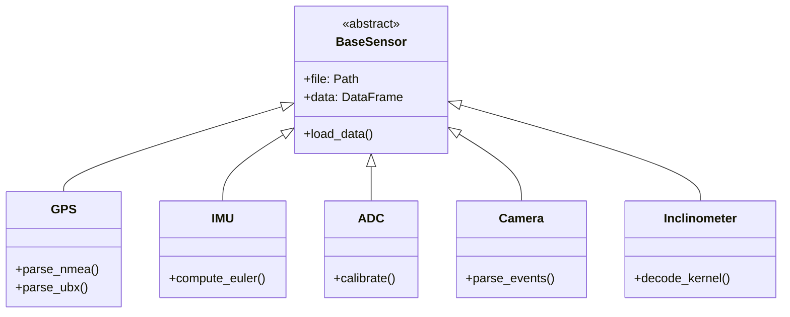
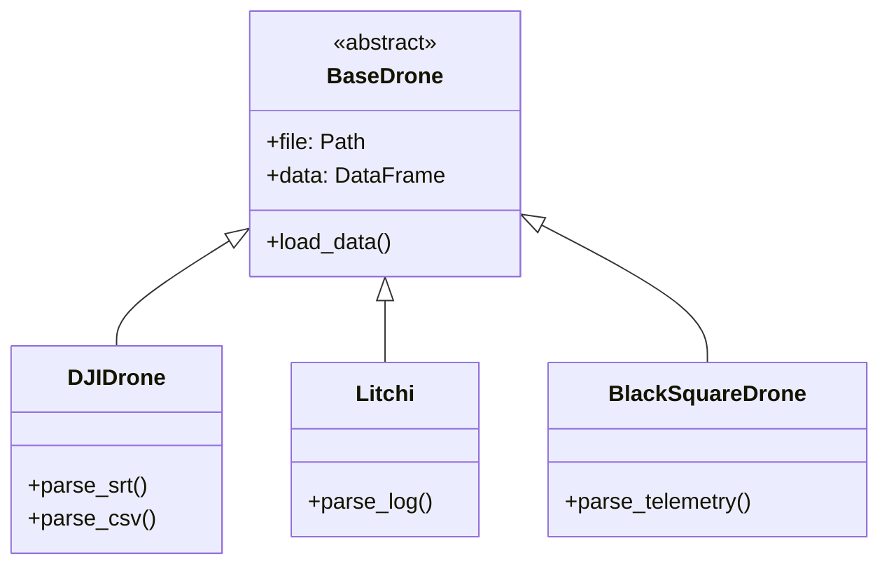
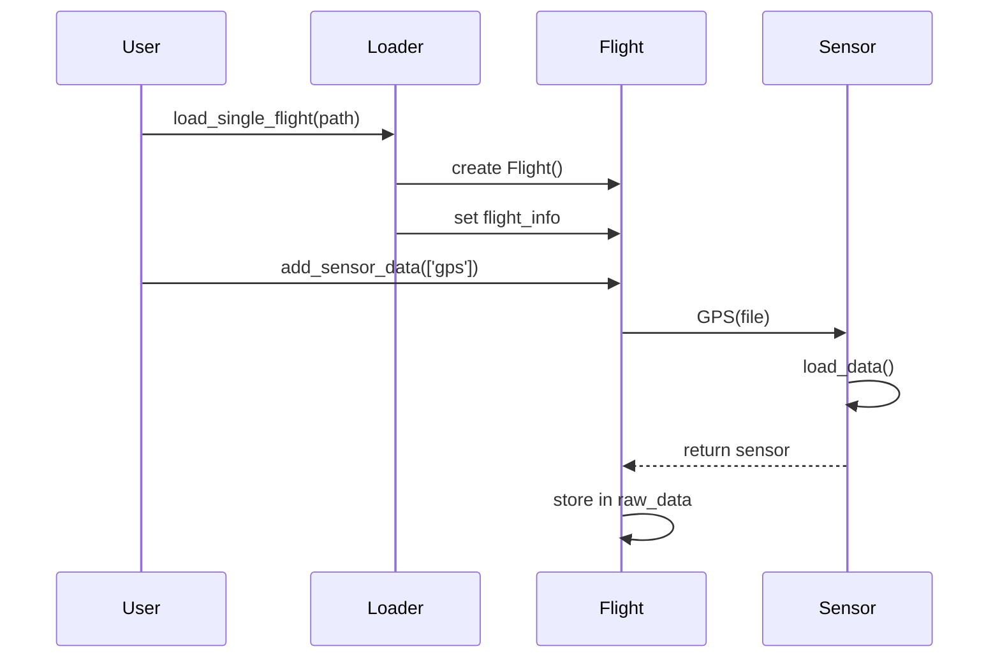
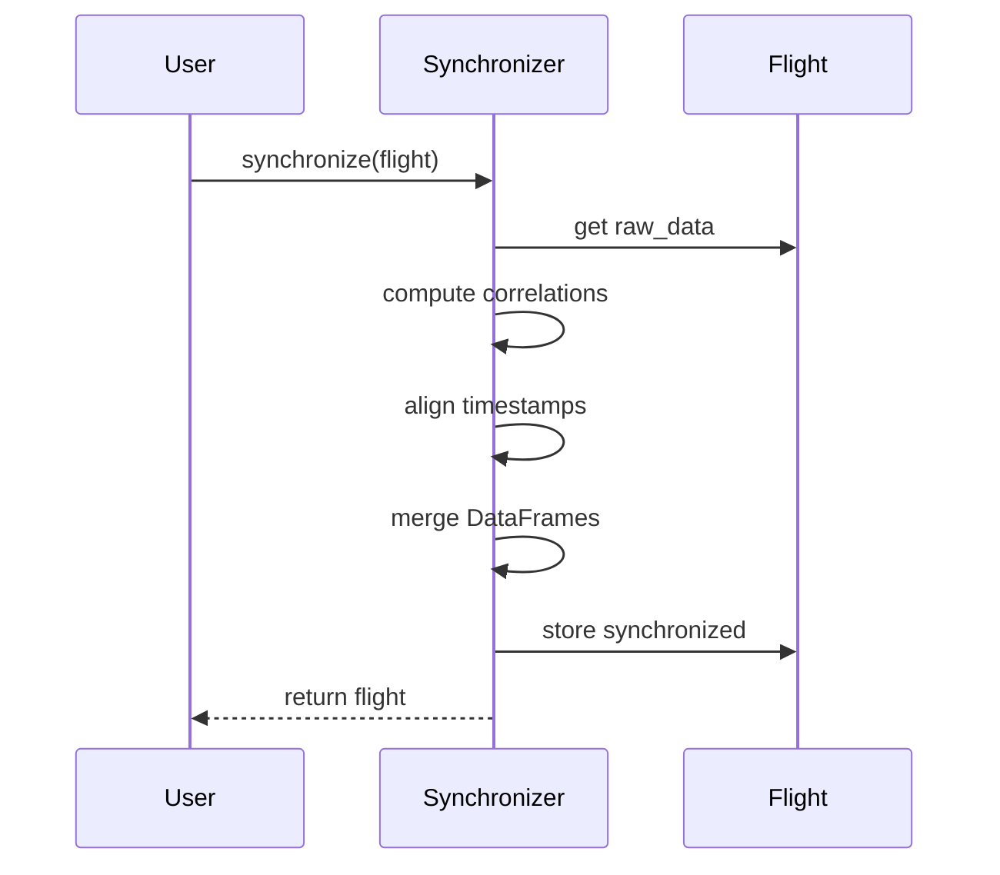
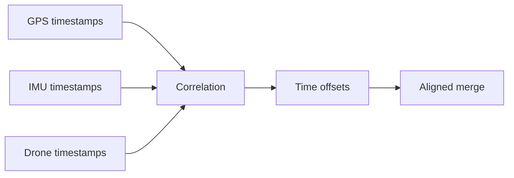
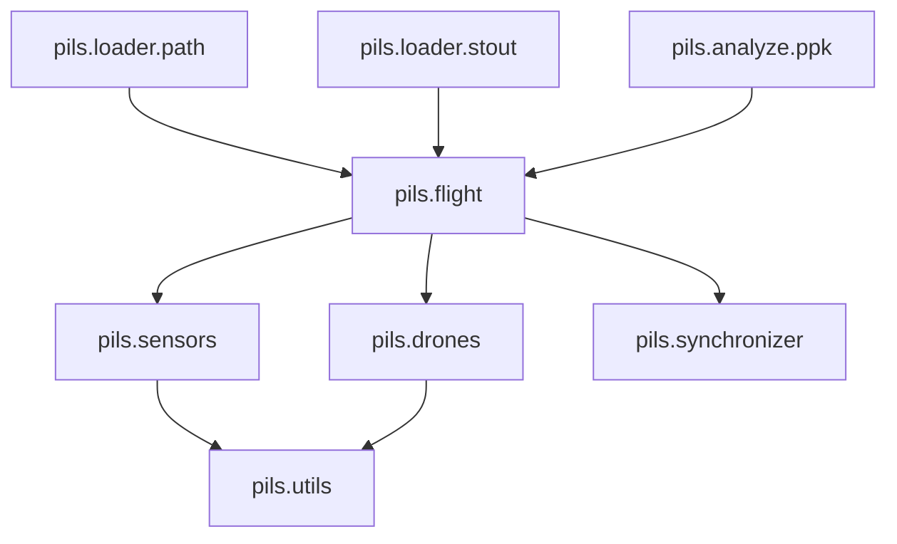

# Architecture

PILS system design and component overview.

## High-Level Architecture



---

## Class Hierarchy

### Core Classes



### Sensor Classes



### Drone Classes



---

## Data Flow

### Loading Pipeline



### Synchronization Pipeline



---

## Component Details

### Flight Container

Central data structure holding all flight information:

```python
flight = Flight(flight_info={...})
flight.raw_data['gps'] = GPS(...)
flight.raw_data['imu'] = IMU(...)
flight.synchronized = merged_df
```

**Responsibilities:**

- Store flight metadata
- Manage raw sensor data
- Store synchronized data versions
- Handle HDF5 serialization

### Loaders

Abstract data source interaction:

| Loader | Source | Features |
|--------|--------|----------|
| PathLoader | Local filesystem | Recursive search, auto-detect |
| StoutLoader | POLOCALC STOUT | API access, caching |

### Sensors

Sensor-specific data handling:

| Sensor | Formats | Features |
|--------|---------|----------|
| GPS | CSV, NMEA, UBX | Coordinate parsing |
| IMU | CSV | Euler computation |
| ADC | CSV | Calibration |
| Camera | CSV | Event parsing |
| Inclinometer | Binary | KERNEL decode |

### Synchronizer

Time alignment of multi-sensor data:



---

## Design Patterns

### Factory Pattern

Sensor creation via registry:

```python
sensor_config = {
    'gps': {'class': GPS, 'load_method': 'load_data'},
    'imu': {'class': IMU, 'load_method': 'load_data'},
}

def create_sensor(sensor_type: str, file: Path):
    config = sensor_config[sensor_type]
    return config['class'](file=file)
```

### Strategy Pattern

Synchronization methods:

```python
class CorrelationSynchronizer:
    def synchronize(self, flight): ...

class InterpolationSynchronizer:
    def synchronize(self, flight): ...
```

### Repository Pattern

Data access abstraction:

```python
class PathLoader:
    def load_single_flight(self, path): ...

class StoutLoader:
    def load_single_flight(self, flight_id): ...
```

---

## Module Dependencies



---

## See Also

- [API Reference](../api/index.md) - Detailed API docs
- [Adding Sensors](adding-sensors.md) - Extend with new sensors
- [Code Style](code-style.md) - Coding standards
