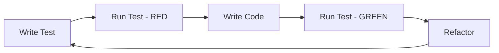

# Testing

Test-driven development practices for PILS.

## Overview

PILS follows strict Test-Driven Development (TDD):



## Running Tests

### Basic Commands

```bash
# Activate environment
conda activate dm

# Run all tests
pytest tests/ -v

# Run with coverage
pytest tests/ -v --cov=pils/

# Run specific test file
pytest tests/test_flight_hdf5.py -v

# Run specific test
pytest tests/test_flight_hdf5.py::TestFlightHDF5::test_save_load -v

# Run tests matching pattern
pytest -k "test_gps" -v
```

### Coverage Report

```bash
# Generate HTML report
pytest tests/ --cov=pils/ --cov-report=html

# Open report
open htmlcov/index.html
```

---

## Test Structure

### Directory Layout

```
tests/
├── __init__.py
├── conftest.py              # Shared fixtures
├── test_flight_hdf5.py      # Flight HDF5 tests
├── test_correlation_sync.py # Synchronizer tests
├── test_ppk_analysis.py     # PPK tests
└── fixtures/
    └── sample_data/         # Test data files
```

### Test Naming

```python
# Pattern: test_{functionality}_{scenario}

def test_load_gps_from_csv():
    """Test loading GPS data from CSV file."""
    pass

def test_load_gps_missing_file_raises():
    """Test that missing file raises FileNotFoundError."""
    pass

def test_sync_with_offset_correction():
    """Test synchronization with time offset correction."""
    pass
```

---

## Writing Tests

### Basic Test Structure

```python
import pytest
import polars as pl
from pathlib import Path

from pils.sensors.gps import GPS


class TestGPS:
    """Test suite for GPS sensor."""
    
    @pytest.fixture
    def sample_csv(self, tmp_path: Path) -> Path:
        """Create sample GPS CSV file."""
        df = pl.DataFrame({
            'timestamp': [1000000, 2000000, 3000000],
            'lat': [40.7128, 40.7129, 40.7130],
            'lon': [-74.0060, -74.0061, -74.0062],
        })
        csv_file = tmp_path / "gps.csv"
        df.write_csv(csv_file)
        return csv_file
    
    def test_load_gps_data(self, sample_csv: Path):
        """Test GPS data loading."""
        gps = GPS(file=sample_csv)
        df = gps.data
        
        assert df.shape[0] == 3
        assert 'timestamp' in df.columns
        assert 'lat' in df.columns
        assert 'lon' in df.columns
    
    def test_gps_schema(self, sample_csv: Path):
        """Test GPS DataFrame schema."""
        gps = GPS(file=sample_csv)
        df = gps.data
        
        assert df['timestamp'].dtype == pl.Int64
        assert df['lat'].dtype == pl.Float64
        assert df['lon'].dtype == pl.Float64
    
    def test_missing_file_raises(self):
        """Test that missing file raises error."""
        with pytest.raises(FileNotFoundError):
            GPS(file=Path("/nonexistent/gps.csv"))
```

### Using Fixtures

```python
# conftest.py - Shared fixtures

import pytest
import polars as pl
from pathlib import Path

from pils.flight import Flight


@pytest.fixture
def sample_flight() -> Flight:
    """Create sample flight for testing."""
    return Flight(flight_info={
        'flight_id': 'test-001',
        'date': '2023-11-01',
    })


@pytest.fixture
def sample_gps_df() -> pl.DataFrame:
    """Create sample GPS DataFrame."""
    return pl.DataFrame({
        'timestamp': [1000000, 2000000, 3000000],
        'lat': [40.7128, 40.7129, 40.7130],
        'lon': [-74.0060, -74.0061, -74.0062],
    })


@pytest.fixture
def sample_imu_df() -> pl.DataFrame:
    """Create sample IMU DataFrame."""
    return pl.DataFrame({
        'timestamp': [1000000, 2000000, 3000000],
        'acc_x': [0.01, 0.02, 0.01],
        'acc_y': [-0.02, -0.01, -0.02],
        'acc_z': [1.01, 1.00, 1.01],
    })
```

### Parametrized Tests

```python
import pytest


@pytest.mark.parametrize("min_ts,expected_rows", [
    (1000000, 3),
    (2000000, 2),
    (3000000, 1),
    (4000000, 0),
])
def test_filter_by_timestamp(sample_csv, min_ts, expected_rows):
    """Test filtering with various timestamp thresholds."""
    gps = GPS(file=sample_csv)
    df = gps.data
    
    filtered = df.filter(pl.col('timestamp') >= min_ts)
    assert filtered.shape[0] == expected_rows
```

---

## Testing Patterns

### Testing Exceptions

```python
def test_invalid_sensor_type_raises():
    """Test that invalid sensor type raises ValueError."""
    flight = Flight(flight_info={'flight_id': 'test'})
    
    with pytest.raises(ValueError, match="Unknown sensor type"):
        flight.add_sensor_data(['invalid_sensor'])


def test_missing_file_error_message():
    """Test error message for missing file."""
    with pytest.raises(FileNotFoundError) as exc_info:
        GPS(file=Path("/missing/file.csv"))
    
    assert "missing/file.csv" in str(exc_info.value)
```

### Testing DataFrames

```python
def test_dataframe_equality(sample_gps_df):
    """Test DataFrame content."""
    expected = pl.DataFrame({
        'timestamp': [1000000, 2000000, 3000000],
        'lat': [40.7128, 40.7129, 40.7130],
        'lon': [-74.0060, -74.0061, -74.0062],
    })
    
    # Use Polars testing utilities
    assert sample_gps_df.frame_equal(expected)


def test_dataframe_schema(sample_gps_df):
    """Test DataFrame schema."""
    schema = sample_gps_df.schema
    
    assert schema['timestamp'] == pl.Int64
    assert schema['lat'] == pl.Float64
```

### Testing HDF5

```python
def test_hdf5_roundtrip(sample_flight, tmp_path):
    """Test saving and loading HDF5."""
    filepath = tmp_path / "flight.h5"
    
    # Save
    sample_flight.to_hdf5(filepath)
    assert filepath.exists()
    
    # Load
    loaded = Flight.from_hdf5(filepath)
    
    assert loaded.flight_info['flight_id'] == sample_flight.flight_info['flight_id']
```

---

## Mocking

### Using pytest-mock

```python
from unittest.mock import Mock, patch


def test_stout_loader_api_call():
    """Test StoutLoader API interaction."""
    with patch('pils.loader.stout.requests.get') as mock_get:
        mock_get.return_value.json.return_value = {
            'flight_id': 'flight-001',
            'status': 'complete',
        }
        
        loader = StoutLoader()
        flight = loader.load_single_flight(flight_id='flight-001')
        
        mock_get.assert_called_once()
        assert flight.flight_info['flight_id'] == 'flight-001'
```

### Mock Files

```python
def test_with_mock_file(tmp_path):
    """Test with temporary file."""
    # Create mock file
    mock_file = tmp_path / "data.csv"
    mock_file.write_text("timestamp,value\n1000000,1.5\n")
    
    # Test with mock file
    df = pl.read_csv(mock_file)
    assert df.shape == (1, 2)
```

---

## Test Categories

### Unit Tests

Test individual components in isolation:

```python
class TestGPSUnit:
    """Unit tests for GPS class."""
    
    def test_parse_coordinate(self):
        """Test coordinate parsing."""
        result = GPS._parse_coordinate("4042.768", "N")
        assert abs(result - 40.7128) < 0.0001
```

### Integration Tests

Test component interactions:

```python
class TestFlightIntegration:
    """Integration tests for Flight."""
    
    def test_add_multiple_sensors(self, sample_flight, tmp_path):
        """Test adding multiple sensors."""
        # Create mock files
        gps_file = tmp_path / "gps.csv"
        imu_file = tmp_path / "imu.csv"
        # ... create files ...
        
        sample_flight.add_sensor_data(['gps', 'imu'])
        
        assert 'gps' in sample_flight.raw_data
        assert 'imu' in sample_flight.raw_data
```

### End-to-End Tests

Test complete workflows:

```python
class TestE2E:
    """End-to-end tests."""
    
    def test_full_pipeline(self, tmp_path):
        """Test complete data pipeline."""
        # Create flight
        # Add sensors
        # Synchronize
        # Export
        # Verify output
        pass
```

---

## CI/CD

### GitHub Actions

```yaml
# .github/workflows/test.yml
name: Tests

on: [push, pull_request]

jobs:
  test:
    runs-on: ubuntu-latest
    steps:
      - uses: actions/checkout@v3
      - name: Set up Python
        uses: actions/setup-python@v4
        with:
          python-version: '3.10'
      - name: Install dependencies
        run: pip install -e ".[dev]"
      - name: Run tests
        run: pytest tests/ -v --cov=pils/
```

---

## See Also

- [Contributing](contributing.md) - Contribution guidelines
- [Code Style](code-style.md) - Coding standards
- [Architecture](architecture.md) - System design
