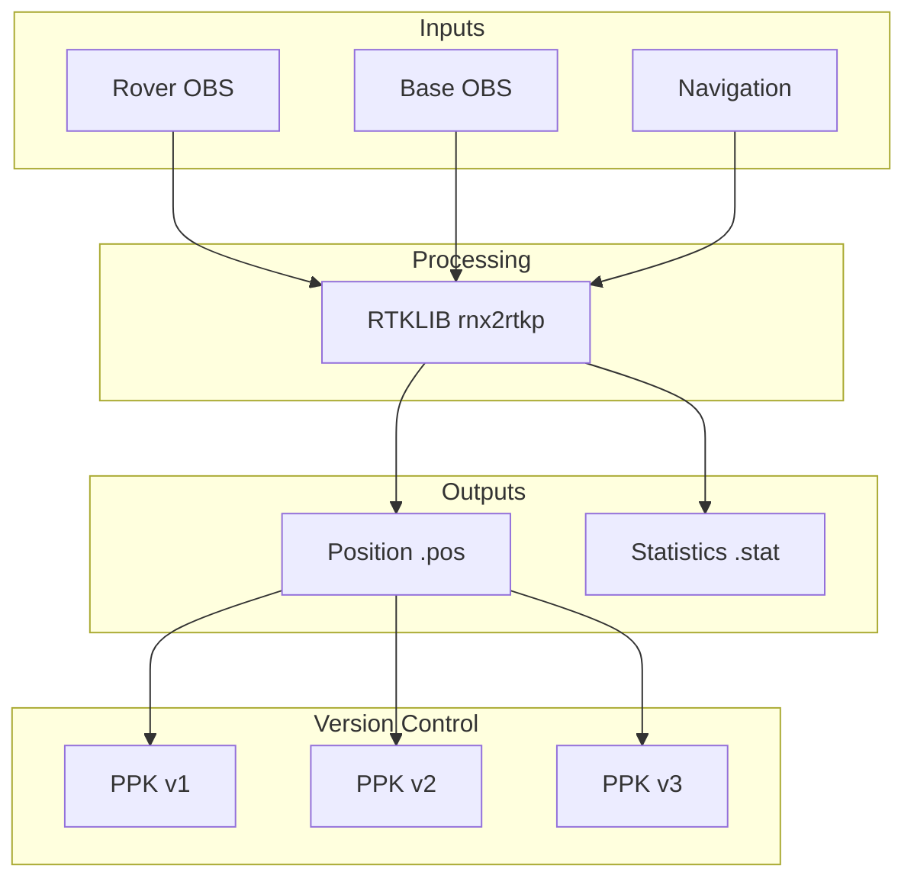

# PPK Analysis

Post-Processed Kinematic (PPK) positioning with version control.

## Overview

PPK processing uses RINEX observation files from a rover (drone) and base station to compute centimeter-level positions after the flight.



## Prerequisites

- **RTKLIB** installed and in PATH (`rnx2rtkp`)
- RINEX observation files (`.obs` or `.o`)
- RINEX navigation files (`.nav` or `.n`)

## Basic Usage

```python
from pils.analyze.ppk import PPKAnalyzer

# Initialize analyzer
ppk = PPKAnalyzer(flight_path=flight.flight_path)

# Process PPK
version = ppk.process(
    rover_obs="rover.obs",
    base_obs="base.obs",
    nav="rover.nav"
)

# Check results
print(f"Version: {version.name}")
print(f"Fix rate: {version.fix_rate:.1%}")
print(f"Mean accuracy: {version.mean_horizontal_accuracy:.3f} m")
```

## PPKAnalyzer API

### Constructor

```python
PPKAnalyzer(
    flight_path: str | Path,
    config_path: Optional[str | Path] = None
)
```

| Parameter | Type | Description |
|-----------|------|-------------|
| `flight_path` | `str \| Path` | Path to flight directory |
| `config_path` | `str \| Path`, optional | Custom RTKLIB config file |

### `process()`

Run PPK processing and create a new version.

```python
def process(
    rover_obs: str | Path,
    base_obs: str | Path,
    nav: str | Path,
    config: Optional[Dict[str, Any]] = None,
    name: Optional[str] = None
) -> PPKVersion
```

| Parameter | Type | Description |
|-----------|------|-------------|
| `rover_obs` | `str \| Path` | Rover RINEX observation file |
| `base_obs` | `str \| Path` | Base RINEX observation file |
| `nav` | `str \| Path` | Navigation file |
| `config` | `Dict`, optional | Override default config |
| `name` | `str`, optional | Custom version name |

### `list_versions()`

Get all available PPK versions.

```python
versions = ppk.list_versions() -> List[PPKVersion]
```

### `get_version()`

Load a specific version.

```python
version = ppk.get_version(name="v_20250102_143022") -> PPKVersion
```

### `compare_versions()`

Compare two PPK versions.

```python
comparison = ppk.compare_versions(
    v1="v_20250102_143022",
    v2="v_20250103_091245"
) -> Dict[str, Any]
```

---

## PPKVersion Class

### Properties

```python
class PPKVersion:
    name: str                      # Version identifier
    timestamp: datetime            # Processing time
    config: Dict[str, Any]         # RTKLIB configuration
    config_hash: str               # SHA256 of config
    
    # Results
    position: pl.DataFrame         # Position solution
    statistics: pl.DataFrame       # Satellite statistics
    
    # Metrics
    fix_rate: float               # Ratio of fixed solutions
    mean_horizontal_accuracy: float  # Mean sdn/sde
    mean_vertical_accuracy: float    # Mean sdu
```

### Position DataFrame Schema

| Column | Type | Unit | Description |
|--------|------|------|-------------|
| `datetime` | `Datetime` | UTC | Solution time |
| `latitude` | `Float64` | degrees | WGS84 latitude |
| `longitude` | `Float64` | degrees | WGS84 longitude |
| `height` | `Float64` | m | Ellipsoidal height |
| `Q` | `Int32` | - | Quality: 1=Fix, 2=Float, 5=Single |
| `ns` | `Int32` | - | Satellites used |
| `sdn` | `Float64` | m | North standard deviation |
| `sde` | `Float64` | m | East standard deviation |
| `sdu` | `Float64` | m | Up standard deviation |
| `sdne` | `Float64` | - | N-E correlation |
| `sdeu` | `Float64` | - | E-U correlation |
| `sdun` | `Float64` | - | U-N correlation |
| `age` | `Float64` | s | Age of differential |
| `ratio` | `Float64` | - | Ambiguity ratio |

### Quality Codes

| Q | Status | Typical Accuracy |
|---|--------|------------------|
| 1 | Fixed | 1-3 cm |
| 2 | Float | 10-50 cm |
| 4 | DGPS | 50-100 cm |
| 5 | Single | 2-5 m |

---

## Version Control

Each PPK run creates a timestamped version:

```
flight_20251208_1506/
└── ppk/
    ├── ppk_data.h5              # All versions in HDF5
    ├── v_20250102_143022/       # Version 1
    │   ├── config.conf
    │   ├── rover.pos
    │   └── rover.stat
    └── v_20250103_091245/       # Version 2
        ├── config.conf
        ├── rover.pos
        └── rover.stat
```

### Smart Re-execution

PPK detects if configuration changed:

```python
# First run
v1 = ppk.process(rover_obs="rover.obs", base_obs="base.obs", nav="rover.nav")

# Same config → returns existing version
v2 = ppk.process(rover_obs="rover.obs", base_obs="base.obs", nav="rover.nav")
print(v1.name == v2.name)  # True

# Changed config → new version
v3 = ppk.process(
    rover_obs="rover.obs", 
    base_obs="base.obs", 
    nav="rover.nav",
    config={'pos1-elmask': 20}  # Changed elevation mask
)
print(v1.name == v3.name)  # False
```

---

## Configuration

### Default RTKLIB Config

```python
default_config = {
    'pos1-posmode': 'kinematic',
    'pos1-frequency': 'l1+l2',
    'pos1-soltype': 'combined',
    'pos1-elmask': 15,
    'pos1-dynamics': 'on',
    'pos1-ionoopt': 'brdc',
    'pos1-tropopt': 'saas',
    'out-solformat': 'llh',
    'out-outhead': 'on',
    'out-outopt': 'on',
    'out-timesys': 'gpst',
    'out-timeform': 'hms',
    'out-height': 'ellipsoidal',
    'stats-eratio1': 100,
    'stats-eratio2': 100,
}
```

### Custom Configuration

```python
# Override specific settings
version = ppk.process(
    rover_obs="rover.obs",
    base_obs="base.obs",
    nav="rover.nav",
    config={
        'pos1-elmask': 20,          # Higher elevation mask
        'pos1-frequency': 'l1',     # L1 only
        'stats-eratio1': 50,        # Different error ratio
    }
)

# Or use complete custom config file
ppk = PPKAnalyzer(
    flight_path=flight.flight_path,
    config_path="/path/to/custom.conf"
)
```

---

## Analysis Examples

### Fix Rate Analysis

```python
import polars as pl

version = ppk.get_version("v_20250102_143022")
pos = version.position

# Count by quality
quality_counts = pos.group_by('Q').agg(pl.count().alias('count'))
print(quality_counts)

# Fix rate over time
pos = pos.with_columns([
    pl.col('datetime').dt.truncate('1m').alias('minute')
])
fix_rate_by_minute = pos.group_by('minute').agg([
    (pl.col('Q') == 1).sum().alias('fixed'),
    pl.count().alias('total')
]).with_columns([
    (pl.col('fixed') / pl.col('total')).alias('fix_rate')
])
```

### Accuracy Analysis

```python
import polars as pl

pos = version.position

# Filter fixed solutions only
fixed = pos.filter(pl.col('Q') == 1)

# Accuracy statistics
stats = fixed.select([
    pl.col('sdn').mean().alias('mean_sdn'),
    pl.col('sde').mean().alias('mean_sde'),
    pl.col('sdu').mean().alias('mean_sdu'),
    pl.col('sdn').max().alias('max_sdn'),
    pl.col('sde').max().alias('max_sde'),
    pl.col('sdu').max().alias('max_sdu'),
])
print(stats)

# Horizontal accuracy (2D RMS)
fixed = fixed.with_columns([
    (pl.col('sdn')**2 + pl.col('sde')**2).sqrt().alias('horizontal_accuracy')
])
print(f"Mean H accuracy: {fixed['horizontal_accuracy'].mean():.3f} m")
```

### Compare Versions

```python
# Compare two processing runs
v1 = ppk.get_version("v_20250102_143022")
v2 = ppk.get_version("v_20250103_091245")

comparison = ppk.compare_versions(v1.name, v2.name)

print(f"Fix rate change: {comparison['fix_rate_diff']:.1%}")
print(f"Accuracy change: {comparison['accuracy_diff']:.3f} m")
print(f"Config differences: {comparison['config_diff']}")
```

### Position Difference

```python
import polars as pl

# Merge on timestamp
v1_pos = v1.position.select(['datetime', 'latitude', 'longitude', 'height'])
v2_pos = v2.position.select(['datetime', 'latitude', 'longitude', 'height'])

merged = v1_pos.join(
    v2_pos, 
    on='datetime', 
    suffix='_v2'
)

# Calculate differences
merged = merged.with_columns([
    (pl.col('latitude') - pl.col('latitude_v2')).alias('lat_diff'),
    (pl.col('longitude') - pl.col('longitude_v2')).alias('lon_diff'),
    (pl.col('height') - pl.col('height_v2')).alias('height_diff'),
])

print(f"Mean lat diff: {merged['lat_diff'].mean():.9f} deg")
print(f"Mean height diff: {merged['height_diff'].mean():.3f} m")
```

---

## HDF5 Storage

All versions stored in single HDF5 file:

```
ppk_data.h5
├── /v_20250102_143022
│   ├── @timestamp
│   ├── @config_hash
│   ├── @config_params (JSON)
│   ├── /position (Dataset)
│   └── /statistics (Dataset)
├── /v_20250103_091245
│   └── ...
└── @latest_version
```

### Direct HDF5 Access

```python
import h5py
import polars as pl

with h5py.File("ppk/ppk_data.h5", "r") as f:
    # List versions
    versions = list(f.keys())
    print(f"Versions: {versions}")
    
    # Read specific version
    v = f['v_20250102_143022']
    print(f"Timestamp: {v.attrs['timestamp']}")
    
    # Read position data
    pos_data = v['position'][:]
    # Convert to Polars...
```

---

## Troubleshooting

### RTKLIB Not Found

```
FileNotFoundError: rnx2rtkp not found in PATH
```

!!! warning "Solution"
    Install RTKLIB and add to PATH:
    ```bash
    # Linux
    sudo apt install rtklib
    
    # Or from source
    git clone https://github.com/tomojitakasu/RTKLIB.git
    cd RTKLIB/app/rnx2rtkp/gcc
    make
    sudo cp rnx2rtkp /usr/local/bin/
    ```

### Low Fix Rate

!!! warning "Possible Causes"
    - Base station too far (>30 km)
    - Poor satellite visibility
    - Cycle slips in data
    - Wrong antenna offsets

!!! tip "Try"
    - Lower elevation mask: `config={'pos1-elmask': 10}`
    - Use combined solution: `config={'pos1-soltype': 'combined'}`
    - Check RINEX file quality

### Memory Issues

For long flights, use lazy evaluation:

```python
# Process in chunks
version = ppk.process(
    rover_obs="rover.obs",
    base_obs="base.obs",
    nav="rover.nav",
    config={'pos1-timeint': 1.0}  # 1 Hz output (not 10 Hz)
)
```

---

## Next Steps

- [Data Export](data-export.md) - Export PPK results
- [RTK Analysis](../api/analysis/rtk.md) - Real-time analysis
