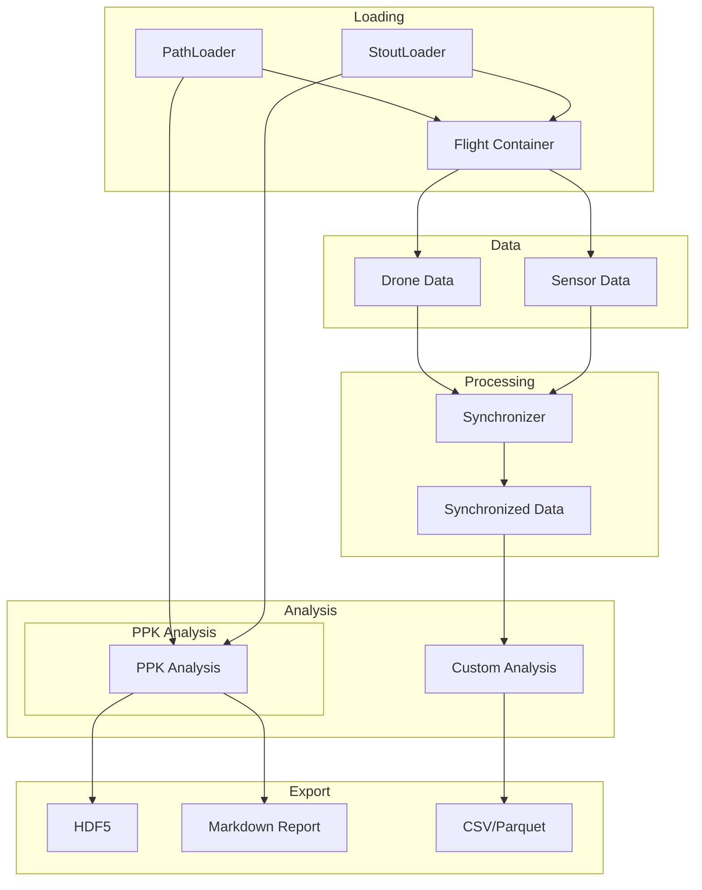

# User Guide

Comprehensive guide to all PILS features and capabilities.

## Overview

PILS provides a complete workflow for the POLOCALC data processing:



## Chapters

<div class="grid cards" markdown>

-   :material-folder-open:{ .lg .middle } __[Loading Flights](loading-flights.md)__

    ---

    Load flights from filesystem or database using PathLoader or StoutLoader

-   :material-radar:{ .lg .middle } __[Working with Sensors](sensors.md)__

    ---

    Access GPS, IMU, ADC, Camera, and Inclinometer data

-   :material-quadcopter:{ .lg .middle } __[Drone Platforms](drones.md)__

    ---

    Support for DJI, ArduPilot (BlackSquare), and Litchi

-   :material-clock-sync:{ .lg .middle } __[Time Synchronization](synchronization.md)__

    ---

    Align data from multiple sources with different timestamps

-   :material-satellite-variant:{ .lg .middle } __[PPK Analysis](ppk-analysis.md)__

    ---

    Post-Processed Kinematic positioning with version control

-   :material-export:{ .lg .middle } __[Data Export](data-export.md)__

    ---

    Export to HDF5, CSV, Parquet, and other formats

</div>

## Quick Reference

### Loading

```python
from pils.loader.path import PathLoader
from pils.flight import Flight

loader = PathLoader(base_path="/campaigns")
flight_info = loader.load_single_flight("flight_20251208_1506")
flight = Flight(flight_info)
```

### Accessing Data

```python
# Drone data
flight.add_drone_data()
drone_df = flight.drone_data['data']

# Sensors
flight.add_sensor_data(['gps', 'imu'])
gps_df = flight['gps'].data
accel_df = flight['imu'].accelerometer
```

### Analysis

```python
from pils.synchronizer import Synchronizer

sync = Synchronizer()
sync.add_gps_reference(gps_df)
sync.add_drone_gps(drone_df)
result = sync.synchronize()
```

### Export

```python
# Complete flight to HDF5
flight.to_hdf5("flight.h5")

# Individual DataFrame
gps_df.write_parquet("gps.parquet")
```
