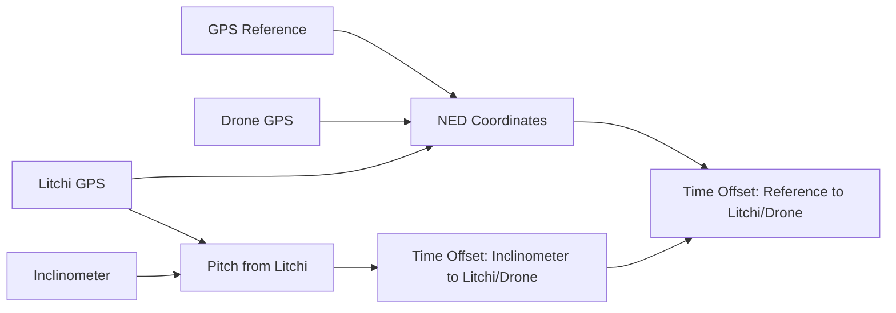

# Time Synchronization

Align data from multiple sources with different time bases.

## The Problem

Different data sources use different time references:

| Source | Time Base | Resolution |
|--------|-----------|------------|
| Sensor GPS | UTC (GNSS) | 1 ms |
| Drone (DJI) | Internal tick | 100 ms |
| Drone (ArduPilot) | Boot time | 1 ms |
| Inclinometer | Internal RTC | 10 ms |
| Camera | Frame index | 33 ms (30fps) |

Synchronization is essential for sensor fusion and accurate analysis.

## Synchronizer Overview

## Mathematical Description of the Calculations

### NED Position Correlation

The NED (North-East-Down) method correlates 3D position signals to find time offsets between GPS sources.

#### Step 1: LLA to ENU Conversion

Convert GPS coordinates to local East-North-Up (ENU) frame relative to reference point:

$$
\begin{aligned}
\Delta\text{lat} &= \text{lat}_{\text{target}} - \text{lat}_{\text{ref}} \\
\Delta\text{lon} &= \text{lon}_{\text{target}} - \text{lon}_{\text{ref}} \\
\\
E &= R \cdot \Delta\text{lon} \cdot \cos(\text{lat}_{\text{ref}}) \\
N &= R \cdot \Delta\text{lat} \\
U &= \text{alt}_{\text{target}} - \text{alt}_{\text{ref}}
\end{aligned}
$$

where $R = 6{,}371{,}000$ m (Earth radius)

#### Step 2: Interpolation to Common Timebase

Both GPS sources are interpolated to a common high-rate timebase (default 100 Hz):

$$
\begin{aligned}
t_{\text{common}} &= [t_{\text{start}}, t_{\text{start}} + \Delta t, \ldots, t_{\text{end}}] \\
\Delta t &= \frac{1}{f_{\text{target}}} = \frac{1}{100\text{ Hz}} = 0.01\text{ s}
\end{aligned}
$$

Interpolated signals:
- $E_1(t), N_1(t), U_1(t)$ - Reference GPS in ENU
- $E_2(t), N_2(t), U_2(t)$ - Target GPS in ENU

#### Step 3: Cross-Correlation Per Axis

Cross-correlation for each spatial axis:

$$
R_{xy}[\tau] = \sum_{t} x(t) \cdot y(t + \tau)
$$

Normalized correlation:

$$
\rho_{xy}[\tau] = \frac{R_{xy}[\tau]}{\sqrt{\sum_t x^2(t) \cdot \sum_t y^2(t)}}
$$

Applied to each axis:
- $\rho_E[\tau]$ - East correlation
- $\rho_N[\tau]$ - North correlation  
- $\rho_U[\tau]$ - Up correlation

#### Step 4: Sub-Sample Peak Detection

Find sub-sample peak using parabolic interpolation around integer peak:

$$
\begin{aligned}
i_{\text{peak}} &= \arg\max_i |\rho[\tau_i]| \\
y_1 &= |\rho[\tau_{i-1}]|, \quad y_2 = |\rho[\tau_i]|, \quad y_3 = |\rho[\tau_{i+1}]| \\
\\
\delta &= \frac{y_1 - y_3}{2(y_1 - 2y_2 + y_3)} \\
\tau_{\text{peak}} &= \tau_i + \delta \cdot \Delta t
\end{aligned}
$$

#### Step 5: Weighted Average Time Offset

Combine offsets from all three axes weighted by correlation strength:

$$
\begin{aligned}
w_E &= |\rho_E[\tau_E]|, \quad w_N = |\rho_N[\tau_N]|, \quad w_U = |\rho_U[\tau_U]| \\
\\
\tau_{\text{offset}} &= \frac{w_E \cdot \tau_E + w_N \cdot \tau_N + w_U \cdot \tau_U}{w_E + w_N + w_U}
\end{aligned}
$$

Overall correlation quality:

$$
\rho_{\text{combined}} = \frac{w_E + w_N + w_U}{3}
$$

#### Step 6: Spatial Offset After Time Alignment

After applying time offset, compute residual spatial offset:

$$
\begin{aligned}
t_2' &= t_2 + \tau_{\text{offset}} \\
E_2'(t_1) &= \text{interp}(E_2, t_2', t_1) \\
\\
\Delta E &= \text{mean}(E_2'(t_1) - E_1(t_1)) \\
\Delta N &= \text{mean}(N_2'(t_1) - N_1(t_1)) \\
\Delta U &= \text{mean}(U_2'(t_1) - U_1(t_1)) \\
\\
d_{\text{spatial}} &= \sqrt{\Delta E^2 + \Delta N^2 + \Delta U^2}
\end{aligned}
$$

### Pitch Correlation

#### Step 1: Interpolation to Common Timebase

Both pitch signals interpolated to high rate (100 Hz):

$$
\begin{aligned}
\theta_1(t) &= \text{interp}(\theta_{\text{Litchi}}, t_{\text{Litchi}}, t_{\text{common}}) \\
\theta_2(t) &= \text{interp}(\theta_{\text{Inclinometer}}, t_{\text{Inclinometer}}, t_{\text{common}})
\end{aligned}
$$

#### Step 2: Cross-Correlation

$$
R_{\theta\theta}[\tau] = \sum_{t} \theta_1(t) \cdot \theta_2(t + \tau)
$$

Normalized:

$$
\rho_{\theta}[\tau] = \frac{R_{\theta\theta}[\tau]}{\sqrt{\sum_t \theta_1^2(t) \cdot \sum_t \theta_2^2(t)}}
$$

#### Step 3: Sub-Sample Peak Detection

Same parabolic interpolation as NED method:

$$
\tau_{\text{pitch}} = \tau_{i_{\text{peak}}} + \delta \cdot \Delta t
$$

#### Step 4: Chained Time Offset

Total time offset to align Inclinometer with GPS payload:

$$
\tau_{\text{Inclinometer→GPS}} = \tau_{\text{Inclinometer→Litchi}} + \tau_{\text{Litchi→GPS}}
$$

This two-stage approach allows synchronization even when Inclinometer and GPS don't share overlapping spatial trajectories, using Litchi gimbal as an intermediate reference.

#### Physical Interpretation

- **Time Offset** ($\tau$): Seconds to add to target timestamp to align with reference
- **Correlation** ($\rho$): Quality metric, range [0, 1]
    - $\rho > 0.9$: Excellent
    - $0.7 < \rho < 0.9$: Good
    - $\rho < 0.7$: Questionable
- **Spatial Offset** ($d$): Residual position error after time alignment (should be < 5m for good GPS)