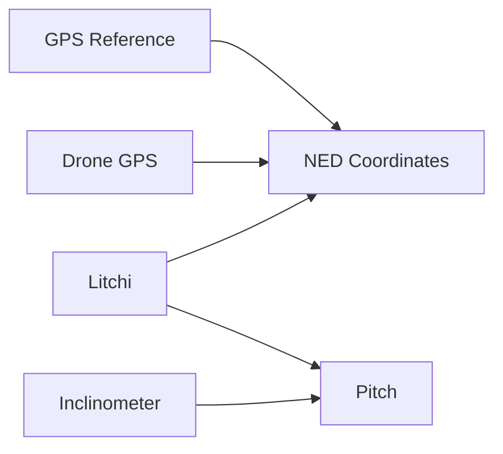

# Time Synchronization

Align data from multiple sources with different time bases.

## The Problem

Different data sources use different time references:

| Source | Time Base | Resolution |
|--------|-----------|------------|
| Sensor GPS | UTC (GNSS) | 1 ms |
| Drone (DJI) | Internal tick | 100 ms |
| Drone (ArduPilot) | Boot time | 1 ms |
| Inclinometer | Internal RTC | 10 ms |
| Camera | Frame index | 33 ms (30fps) |

Synchronization is essential for sensor fusion and accurate analysis.

## Synchronizer Overview



## Basic Usage

```python
from pils.synchronizer import Synchronizer
import polars as pl

# Create synchronizer
sync = Synchronizer()

# Add reference GPS (from sensor)
gps_df = flight['gps'].data
sync.add_gps_reference(gps_df)

# Add drone GPS
drone_df = flight.drone_data['data']
sync.add_drone_gps(drone_df)

# Compute synchronization
result = sync.synchronize()

print(f"GPS offset: {result['gps_offset']:.3f} seconds")
print(f"Pitch offset: {result['pitch_offset']:.2f} degrees")
```

## Synchronizer API

### Constructor

```python
Synchronizer(
    method: str = 'correlation',
    window: float = 10.0,
    min_overlap: float = 0.5
)
```

| Parameter | Type | Default | Description |
|-----------|------|---------|-------------|
| `method` | `str` | `'correlation'` | Sync method: `'correlation'`, `'nearest'` |
| `window` | `float` | `10.0` | Search window in seconds |
| `min_overlap` | `float` | `0.5` | Minimum overlap ratio (0-1) |

### Methods

#### `add_gps_reference()`

Add high-accuracy GPS as time reference.

```python
sync.add_gps_reference(
    gps_df: pl.DataFrame,
    timestamp_col: str = 'timestamp',
    lat_col: str = 'latitude',
    lon_col: str = 'longitude'
) -> None
```

#### `add_drone_gps()`

Add drone GPS data to align.

```python
sync.add_drone_gps(
    drone_df: pl.DataFrame,
    timestamp_col: str = 'datetime',
    lat_col: str = 'latitude',
    lon_col: str = 'longitude'
) -> None
```

#### `synchronize()`

Compute time offset and attitude offset.

```python
result = sync.synchronize() -> Dict[str, Any]
```

**Returns:**

```python
{
    'gps_offset': float,      # Seconds to add to drone time
    'pitch_offset': float,    # Degrees difference
    'quality': float,         # Correlation quality (0-1)
    'method': str,            # Method used
    'metadata': {
        'overlap_samples': int,
        'reference_duration': float,
        'drone_duration': float,
    }
}
```

---

## Synchronization Methods

### Correlation Method

Default method using cross-correlation of position time series.

```python
sync = Synchronizer(method='correlation')
```

**How it works:**

1. Resample both GPS to common rate
2. Compute cross-correlation of lat/lon
3. Find peak correlation → time offset
4. Validate with pitch comparison

**Best for:** High-quality GPS with similar sampling rates

??? info "Mathematical Details: NED Position Correlation"

    The NED (North-East-Down) method correlates 3D position signals to find time offsets between GPS sources.

    #### Step 1: LLA to ENU Conversion

    Convert GPS coordinates to local East-North-Up (ENU) frame relative to reference point:

    $$
    \begin{aligned}
    \Delta\text{lat} &= \text{lat}_{\text{target}} - \text{lat}_{\text{ref}} \\
    \Delta\text{lon} &= \text{lon}_{\text{target}} - \text{lon}_{\text{ref}} \\
    \\
    E &= R \cdot \Delta\text{lon} \cdot \cos(\text{lat}_{\text{ref}}) \\
    N &= R \cdot \Delta\text{lat} \\
    U &= \text{alt}_{\text{target}} - \text{alt}_{\text{ref}}
    \end{aligned}
    $$

    where $R = 6{,}371{,}000$ m (Earth radius)

    #### Step 2: Interpolation to Common Timebase

    Both GPS sources are interpolated to a common high-rate timebase (default 100 Hz):

    $$
    \begin{aligned}
    t_{\text{common}} &= [t_{\text{start}}, t_{\text{start}} + \Delta t, \ldots, t_{\text{end}}] \\
    \Delta t &= \frac{1}{f_{\text{target}}} = \frac{1}{100\text{ Hz}} = 0.01\text{ s}
    \end{aligned}
    $$

    Interpolated signals:
    - $E_1(t), N_1(t), U_1(t)$ - Reference GPS in ENU
    - $E_2(t), N_2(t), U_2(t)$ - Target GPS in ENU

    #### Step 3: Cross-Correlation Per Axis

    Cross-correlation for each spatial axis:

    $$
    R_{xy}[\tau] = \sum_{t} x(t) \cdot y(t + \tau)
    $$

    Normalized correlation:

    $$
    \rho_{xy}[\tau] = \frac{R_{xy}[\tau]}{\sqrt{\sum_t x^2(t) \cdot \sum_t y^2(t)}}
    $$

    Applied to each axis:
    - $\rho_E[\tau]$ - East correlation
    - $\rho_N[\tau]$ - North correlation  
    - $\rho_U[\tau]$ - Up correlation

    #### Step 4: Sub-Sample Peak Detection

    Find sub-sample peak using parabolic interpolation around integer peak:

    $$
    \begin{aligned}
    i_{\text{peak}} &= \arg\max_i |\rho[\tau_i]| \\
    y_1 &= |\rho[\tau_{i-1}]|, \quad y_2 = |\rho[\tau_i]|, \quad y_3 = |\rho[\tau_{i+1}]| \\
    \\
    \delta &= \frac{y_1 - y_3}{2(y_1 - 2y_2 + y_3)} \\
    \tau_{\text{peak}} &= \tau_i + \delta \cdot \Delta t
    \end{aligned}
    $$

    #### Step 5: Weighted Average Time Offset

    Combine offsets from all three axes weighted by correlation strength:

    $$
    \begin{aligned}
    w_E &= |\rho_E[\tau_E]|, \quad w_N = |\rho_N[\tau_N]|, \quad w_U = |\rho_U[\tau_U]| \\
    \\
    \tau_{\text{offset}} &= \frac{w_E \cdot \tau_E + w_N \cdot \tau_N + w_U \cdot \tau_U}{w_E + w_N + w_U}
    \end{aligned}
    $$

    Overall correlation quality:

    $$
    \rho_{\text{combined}} = \frac{w_E + w_N + w_U}{3}
    $$

    #### Step 6: Spatial Offset After Time Alignment

    After applying time offset, compute residual spatial offset:

    $$
    \begin{aligned}
    t_2' &= t_2 + \tau_{\text{offset}} \\
    E_2'(t_1) &= \text{interp}(E_2, t_2', t_1) \\
    \\
    \Delta E &= \text{mean}(E_2'(t_1) - E_1(t_1)) \\
    \Delta N &= \text{mean}(N_2'(t_1) - N_1(t_1)) \\
    \Delta U &= \text{mean}(U_2'(t_1) - U_1(t_1)) \\
    \\
    d_{\text{spatial}} &= \sqrt{\Delta E^2 + \Delta N^2 + \Delta U^2}
    \end{aligned}
    $$

??? info "Mathematical Details: Pitch Correlation (Double Synchronization)"

    The pitch method performs hierarchical synchronization: **Inclinometer → Litchi → GPS**

    #### Two-Stage Process

    **Stage 1: Litchi ↔ GPS** (NED correlation)
    
    Uses NED position correlation (described above) to find time offset between Litchi waypoints and GPS payload:
    
    $$
    \tau_{\text{Litchi→GPS}} = \text{NED\_correlation}(\text{GPS}_{\text{payload}}, \text{Litchi})
    $$

    **Stage 2: Inclinometer ↔ Litchi** (Pitch correlation)
    
    Uses pitch angle correlation to find time offset between Inclinometer and Litchi gimbal pitch:
    
    $$
    \tau_{\text{Inclinometer→Litchi}} = \text{Pitch\_correlation}(\text{Litchi}_{\text{gimbal}}, \text{Inclinometer})
    $$

    #### Pitch Correlation Method

    **Step 1: Interpolation to Common Timebase**

    Both pitch signals interpolated to high rate (100 Hz):

    $$
    \begin{aligned}
    \theta_1(t) &= \text{interp}(\theta_{\text{Litchi}}, t_{\text{Litchi}}, t_{\text{common}}) \\
    \theta_2(t) &= \text{interp}(\theta_{\text{Inclinometer}}, t_{\text{Inclinometer}}, t_{\text{common}})
    \end{aligned}
    $$

    **Step 2: Cross-Correlation**

    $$
    R_{\theta\theta}[\tau] = \sum_{t} \theta_1(t) \cdot \theta_2(t + \tau)
    $$

    Normalized:

    $$
    \rho_{\theta}[\tau] = \frac{R_{\theta\theta}[\tau]}{\sqrt{\sum_t \theta_1^2(t) \cdot \sum_t \theta_2^2(t)}}
    $$

    **Step 3: Sub-Sample Peak Detection**

    Same parabolic interpolation as NED method:

    $$
    \tau_{\text{pitch}} = \tau_{i_{\text{peak}}} + \delta \cdot \Delta t
    $$

    **Step 4: Chained Time Offset**

    Total time offset to align Inclinometer with GPS payload:

    $$
    \tau_{\text{Inclinometer→GPS}} = \tau_{\text{Inclinometer→Litchi}} + \tau_{\text{Litchi→GPS}}
    $$

    This two-stage approach allows synchronization even when Inclinometer and GPS don't share overlapping spatial trajectories, using Litchi gimbal as an intermediate reference.

    #### Physical Interpretation

    - **Time Offset** ($\tau$): Seconds to add to target timestamp to align with reference
    - **Correlation** ($\rho$): Quality metric, range [0, 1]
      - $\rho > 0.9$: Excellent
      - $0.7 < \rho < 0.9$: Good
      - $\rho < 0.7$: Questionable
    - **Spatial Offset** ($d$): Residual position error after time alignment (should be < 5m for good GPS)

### Nearest Method

Simple nearest-neighbor matching.

```python
sync = Synchronizer(method='nearest')
```

**How it works:**

1. For each drone position, find nearest sensor position
2. Compute time differences
3. Return median offset

**Best for:** Low-overlap data, quick estimates

---

## Advanced Usage

### Custom Timestamp Columns

```python
sync = Synchronizer()

# Reference with custom columns
sync.add_gps_reference(
    gps_df,
    timestamp_col='gps_time_ms',
    lat_col='lat_deg',
    lon_col='lon_deg'
)

# Drone with custom columns
sync.add_drone_gps(
    drone_df,
    timestamp_col='tick',
    lat_col='gps_lat',
    lon_col='gps_lon'
)

result = sync.synchronize()
```

### Apply Offset to Data

```python
import polars as pl

# Get offset
result = sync.synchronize()
offset_ms = int(result['gps_offset'] * 1000)

# Apply to drone data
drone_df = drone_df.with_columns([
    (pl.col('timestamp') + offset_ms).alias('timestamp_synced')
])

# Verify alignment
print(f"Original range: {drone_df['timestamp'].min()} - {drone_df['timestamp'].max()}")
print(f"Synced range: {drone_df['timestamp_synced'].min()} - {drone_df['timestamp_synced'].max()}")
```

### Multi-Sensor Synchronization

```python
sync = Synchronizer()

# Reference: high-accuracy sensor GPS
sync.add_gps_reference(flight['gps'].data)

# First drone
sync.add_drone_gps(flight.drone_data['data'])
drone_offset = sync.synchronize()['gps_offset']

# Reset and add inclinometer
sync2 = Synchronizer()
sync2.add_gps_reference(flight['gps'].data)
sync2.add_drone_gps(flight['inclinometer'].data)  # If has GPS
inclino_offset = sync2.synchronize()['gps_offset']

print(f"Drone offset: {drone_offset:.3f}s")
print(f"Inclinometer offset: {inclino_offset:.3f}s")
```

---

## Handling Edge Cases

### No Overlap

```python
sync = Synchronizer(min_overlap=0.3)  # Lower threshold

try:
    result = sync.synchronize()
except ValueError as e:
    print(f"Insufficient overlap: {e}")
```

### Large Time Offset

```python
# Expand search window
sync = Synchronizer(window=60.0)  # 60 seconds

result = sync.synchronize()
if abs(result['gps_offset']) > 30:
    print(f"Warning: Large offset detected: {result['gps_offset']:.1f}s")
```

### Different Sampling Rates

The correlation method automatically handles different rates:

```python
# Sensor GPS at 10 Hz
# Drone GPS at 1 Hz
# Synchronizer resamples internally

sync = Synchronizer()
sync.add_gps_reference(gps_10hz)
sync.add_drone_gps(drone_1hz)
result = sync.synchronize()  # Works correctly
```

---

## Quality Assessment

### Check Correlation Quality

```python
result = sync.synchronize()

if result['quality'] < 0.7:
    print("Warning: Low synchronization quality")
    print("Possible causes:")
    print("  - Insufficient motion during overlap")
    print("  - GPS multipath or interference")
    print("  - Different flight paths")
```

### Visualize Alignment

```python
import matplotlib.pyplot as plt

# After synchronization
offset_ms = int(result['gps_offset'] * 1000)

# Shift drone timestamps
drone_synced = drone_df.with_columns([
    (pl.col('timestamp') + offset_ms).alias('ts_synced')
])

# Plot comparison
fig, ax = plt.subplots(figsize=(12, 6))
ax.plot(gps_df['timestamp'], gps_df['latitude'], label='Sensor GPS')
ax.plot(drone_synced['ts_synced'], drone_synced['latitude'], label='Drone GPS (synced)')
ax.legend()
ax.set_xlabel('Timestamp (ms)')
ax.set_ylabel('Latitude')
plt.show()
```

---

## Best Practices

!!! tip "Use High-Accuracy Reference"
    The sensor GPS (RTK if available) should be the reference, not the drone GPS.

!!! tip "Ensure Motion"
    Synchronization works best when there's significant motion during the overlap period.

!!! tip "Check Quality"
    Always check `result['quality']`. Values below 0.7 indicate potential issues.

!!! tip "Validate Visually"
    Plot the aligned data to visually confirm synchronization.

!!! warning "Time Zone Issues"
    Ensure all timestamps are in the same time zone (preferably UTC).

---

## Next Steps

- [PPK Analysis](ppk-analysis.md) - Post-processed positioning
- [Data Export](data-export.md) - Save synchronized data
